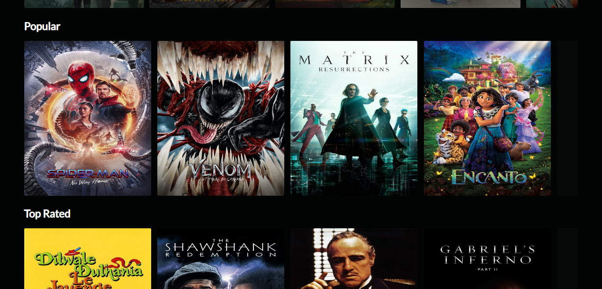

[](https://github.com/Debarshi95/my-movies/actions)

# MyMovies

A ReactJS web app for movies and shows.

## Demo

[Deployed on Netlify using github actions](https://debarshib-mymovies.netlify.app)

## Features:

- Provies information about movies and shows.
- Movies and Shows grouped based on various categories.
- Horizontal scrolling list of genres.
- Search facility.
- Detailed information about a particular movie/show.
- Uses custom hook based on Intersection Observer to facilitate lazyloading of images.
- Redux store persisted in localStorage to reduce network calls.
- Error management using ErrorBoundary to catch and show fallback UI.
- LazyLoading/Code-splitting of components and reducers on routes to dynamically load at runtime.
- Loading Spinner when fetching initial data.
- Responsive UI for all screens (Desktop, Tablet, Mobile)

## Built using:

- [ReactJS](https://reactjs.org/) - Frontend framework
- [Redux](https://redux.js.org/) - For a centralized state.
- [React Router](https://reactrouter.com/) - For routing & navigation
- [Redux-Saga](https://redux-saga.js.org/) - For handling the asynchronous network calls based on actions.
- [React-Redux](https://react-redux.js.org/) - Official React bindings for Redux.
- [Reselect](https://github.com/reduxjs/reselect) - For creating memoized "selector" functions.
- [Redux-Persist](https://github.com/rt2zz/redux-persist) - To persist on local storage and rehydrate.
- [Redux-Sauce](https://github.com/jkeam/reduxsauce) - Easily create action type and action creators without extra boiler plate.
- [Redux-Injectors](https://github.com/react-boilerplate/redux-injectors) - To dynamically inject reducers and sagas at different route.
- [PropTypes](https://github.com/facebook/prop-types) - Runtime type checking for React props and similar objects.

## Screenshots

#### Desktop





<br/>

#### Mobile

<br/>
<div align="center">


</div>

## Run Locally

- Clone the project
  `git clone https://github.com/Debarshi95/My-Movies.git`
- Go to the project directory
- cd mymovies
- Install dependencies
  `npm install`
- Create a **.env** file

- Get an **API_TOKEN** from TMDB and them add it to the .env file
- Add the following configuration to your .env file

```
REACT_APP_API_TOKEN="<TMDB_API_TOKEN>"
REACT_APP_TMBD_URL=https://api.themoviedb.org/3
REACT_APP_IMAGE_URL=https://image.tmdb.org/t/p
REACT_APP_POSTER_IMAGE=https://image.tmdb.org/t/p/w500
REACT_APP_BACKDROP_IMAGE=https://image.tmdb.org/t/p/w1280
```

- Start the server
  `yarn start`

## License

[MIT](https://github.com/Debarshi95/My-Movies/blob/master/LICENSE)
